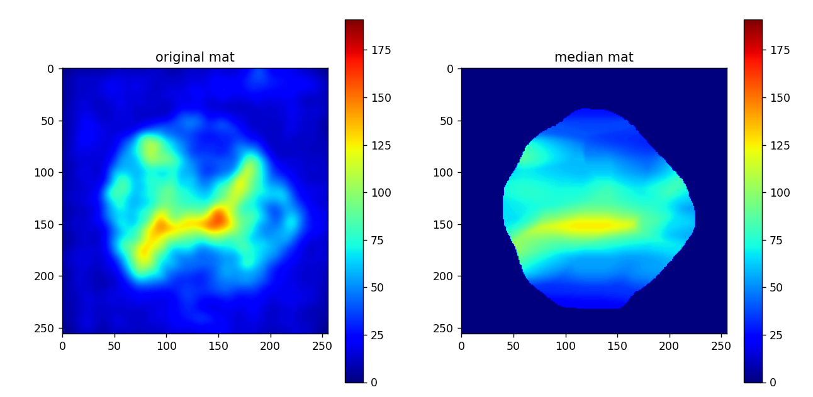

# 正規パーセンタイルフィルタ (regular-percentile-filter)

画像上に次のようなパーセンタイルフィルタを掛ける．

- 正規 (前景マスクを与えることで，前景領域のみからパーセンタイル値を計算)
- 高速 (numba による高速処理)
- 中央値にも対応 (percentile=50.0 を指定)
- 異方的 (縦方向のカーネルサイズと横方向のカーネルサイズを別で指定できる)

## 適用例




## 使い方

```python
from lib_percentile_filter import percentileFilter

medianMat = percentileFilter(
    srcMat, # 入力画像
    ky=10, # 縦方向のカーネルサイズ
    kx=100, # 横方向のカーネルサイズ
    foreMask=foreMask, # 前景マスク (0~1)．optinal 引数．何も入れない場合は全体を前景と見做す．
    percentile=50., # optional 引数．何も入れない場合は 50% つまり中央値フィルタとなる．
)
```

※ lib_percentile_filter.py の
```
if __name__ == '__main__':
```
以下に使用例がある．